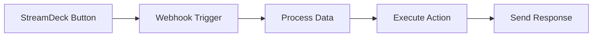

# N8N StreamDeck User Guide

Complete guide for installing, configuring, and using the N8N StreamDeck integration.

## Table of Contents

- [Installation](#installation)
- [Initial Setup](#initial-setup)
- [Configuration](#configuration)
- [Using the Web Interface](#using-the-web-interface)
- [StreamDeck Configuration](#streamdeck-configuration)
- [N8N Integration](#n8n-integration)
- [Troubleshooting](#troubleshooting)
- [FAQ](#faq)

## Installation

### Prerequisites

Before installing N8N StreamDeck, ensure you have:

- **Node.js** 18.0.0 or higher
- **pnpm** 8.0.0 or higher
- **Elgato StreamDeck** device (any model)
- **N8N** instance (local or cloud)
- **Operating System**: Windows 10+, macOS 10.15+, or Linux

### System Requirements

| Component | Minimum            | Recommended       |
| --------- | ------------------ | ----------------- |
| RAM       | 4GB                | 8GB+              |
| Storage   | 1GB free space     | 2GB+ free space   |
| CPU       | Dual-core 2GHz     | Quad-core 2.5GHz+ |
| Network   | Broadband internet | Stable broadband  |

### Installation Methods

#### Method 1: Docker (Recommended)

```bash
# Clone the repository
git clone https://github.com/ianwijma/n8n-streamdeck.git
cd n8n-streamdeck

# Start with Docker Compose
docker-compose -f docker-compose.prod.yml up -d

# Check status
docker-compose -f docker-compose.prod.yml ps
```

#### Method 2: Manual Installation

```bash
# Clone the repository
git clone https://github.com/ianwijma/n8n-streamdeck.git
cd n8n-streamdeck

# Install dependencies
pnpm install

# Build all packages
pnpm build

# Start the application
pnpm dev
```

#### Method 3: Pre-built Binaries

Download the latest release from [GitHub Releases](https://github.com/ianwijma/n8n-streamdeck/releases):

1. Download the appropriate binary for your OS
2. Extract to your preferred directory
3. Run the executable

### Verification

After installation, verify the setup:

```bash
# Check if services are running
curl http://localhost:3000/health

# Expected response:
{
  "status": "healthy",
  "timestamp": "2024-01-01T00:00:00.000Z",
  "version": "1.0.0"
}
```

## Initial Setup

### First-Time Configuration

1. **Open the Web Interface**
   - Navigate to `http://localhost:3000` in your browser
   - You should see the setup wizard

2. **Create Admin Account**
   - Username: Choose a secure username (3-50 characters)
   - Password: Create a strong password (minimum 8 characters)
   - Click "Complete Setup"

3. **Connect Your StreamDeck**
   - Ensure your StreamDeck is connected via USB
   - The device should appear automatically in the interface
   - If not detected, try unplugging and reconnecting

4. **Configure N8N Connection**
   - Enter your N8N instance URL
   - Provide API key or authentication details
   - Test the connection

### Environment Configuration

Create a `.env` file in the root directory:

```env
# Server Configuration
PORT=3000
NODE_ENV=production

# N8N Configuration
N8N_URL=https://your-n8n-instance.com
N8N_API_KEY=your-api-key-here

# StreamDeck Configuration
STREAMDECK_PORT=28472
STREAMDECK_AUTO_CONNECT=true

# Security
JWT_SECRET=your-secure-jwt-secret-here
SESSION_SECRET=your-secure-session-secret-here

# Logging
LOG_LEVEL=info
LOG_FILE=logs/app.log

# CORS (for web interface)
CORS_ORIGINS=http://localhost:3001,https://your-domain.com
```

## Configuration

### Basic Configuration

#### Device Settings

1. **Brightness Control**
   - Adjust brightness: 0-100%
   - Auto-dim after inactivity
   - Schedule brightness changes

2. **Connection Settings**
   - Auto-reconnect on disconnect
   - Connection timeout settings
   - USB port preferences

#### Button Layout

1. **Grid Configuration**
   - Standard StreamDeck: 3x5 (15 buttons)
   - StreamDeck Mini: 2x3 (6 buttons)
   - StreamDeck XL: 4x8 (32 buttons)

2. **Button Spacing**
   - Margin between buttons
   - Icon size and positioning
   - Text overlay options

### Advanced Configuration

#### N8N Webhook Setup

1. **Create Webhook Node in N8N**

   ```json
   {
     "httpMethod": "POST",
     "path": "streamdeck-trigger",
     "responseMode": "responseNode",
     "authentication": "none"
   }
   ```

2. **Configure Webhook URL**
   - Format: `https://your-n8n.com/webhook/streamdeck-trigger`
   - Add query parameters for button identification
   - Example: `?device=streamdeck_001&button=0`

3. **Workflow Trigger Logic**

   ```javascript
   // In N8N Function node
   const buttonData = $json.query;
   const deviceId = buttonData.device;
   const buttonPosition = buttonData.button;

   // Your workflow logic here
   return {
     triggered: true,
     device: deviceId,
     button: buttonPosition,
     timestamp: new Date().toISOString(),
   };
   ```

#### Security Configuration

1. **Authentication**
   - Enable/disable authentication
   - Session timeout settings
   - Multi-factor authentication (future)

2. **API Security**
   - Rate limiting configuration
   - CORS settings
   - API key management

3. **Network Security**
   - HTTPS configuration
   - Firewall settings
   - VPN requirements

## Using the Web Interface

### Dashboard Overview

The main dashboard provides:

- **Device Status**: Connected StreamDeck devices
- **Button Overview**: Configured buttons and their status
- **Activity Log**: Recent button presses and events
- **System Health**: Service status and performance metrics

### Device Management

#### Adding a Device

1. Connect your StreamDeck via USB
2. Go to "Devices" in the navigation
3. Click "Scan for Devices"
4. Select your device and click "Connect"

#### Device Configuration

1. **Basic Settings**
   - Device name and description
   - Brightness level
   - Auto-sleep settings

2. **Advanced Settings**
   - Button layout customization
   - Color profiles
   - Performance settings

### Button Configuration

#### Creating a Button

1. **Select Device and Position**
   - Choose your StreamDeck device
   - Click on an empty button position

2. **Basic Configuration**
   - **Title**: Display text on button
   - **Icon**: Upload image or choose from library
   - **Background Color**: Hex color code

3. **N8N Integration**
   - **Workflow ID**: N8N workflow identifier
   - **Webhook URL**: Complete webhook endpoint
   - **Parameters**: Additional data to send

4. **Advanced Options**
   - **Press Duration**: Short/long press detection
   - **Confirmation**: Require confirmation before trigger
   - **Cooldown**: Minimum time between presses

#### Button Templates

Pre-configured button templates:

1. **Deployment Buttons**
   - Deploy to staging
   - Deploy to production
   - Rollback deployment

2. **Monitoring Buttons**
   - Check system health
   - View error logs
   - Restart services

3. **Notification Buttons**
   - Send team alerts
   - Create incident tickets
   - Update status pages

### Activity Monitoring

#### Real-time Events

- Button press events
- Device connection status
- Workflow execution results
- Error notifications

#### Event History

- Searchable event log
- Filter by device, button, or time
- Export event data
- Performance analytics

## StreamDeck Configuration

### Physical Setup

1. **USB Connection**
   - Use the provided USB cable
   - Connect directly to computer (avoid hubs if possible)
   - Ensure stable connection

2. **Positioning**
   - Place on stable surface
   - Ensure good viewing angle
   - Consider cable management

### Button Design Guidelines

#### Visual Design

1. **Icons**
   - Use 72x72 pixel images for best quality
   - PNG format with transparency support
   - High contrast for visibility
   - Consistent style across buttons

2. **Text**
   - Keep titles short (1-3 words)
   - Use readable fonts
   - High contrast with background
   - Consider button size limitations

3. **Colors**
   - Use consistent color scheme
   - Consider color-blind accessibility
   - Different colors for different functions
   - Avoid overly bright colors

#### Functional Design

1. **Button Grouping**
   - Group related functions together
   - Use visual separators
   - Logical flow from left to right
   - Most used buttons in easy reach

2. **Feedback**
   - Visual confirmation of press
   - Status indicators (success/error)
   - Progress indicators for long operations
   - Clear error states

### Multi-Device Setup

#### Device Naming

- Use descriptive names (e.g., "Main Desk", "Meeting Room")
- Include location or purpose
- Consistent naming convention
- Easy identification in interface

#### Profile Management

- Different button layouts per device
- Context-specific configurations
- Easy switching between profiles
- Backup and restore profiles

## N8N Integration

### Workflow Design

#### Basic Webhook Workflow



#### Advanced Workflow Patterns

1. **Conditional Execution**

   ```javascript
   // Check button context
   if ($json.button === 0) {
     // Deploy to staging
   } else if ($json.button === 1) {
     // Deploy to production
   }
   ```

2. **Error Handling**

   ```javascript
   try {
     // Execute main logic
     return { success: true, result: data };
   } catch (error) {
     return {
       success: false,
       error: error.message,
       timestamp: new Date().toISOString(),
     };
   }
   ```

3. **Async Operations**

   ```javascript
   // Start long-running process
   const jobId = await startDeployment();

   // Return immediate response
   return {
     status: 'started',
     jobId: jobId,
     message: 'Deployment started',
   };
   ```

### Common Use Cases

#### DevOps Automation

1. **Deployment Pipeline**
   - Trigger builds
   - Deploy to environments
   - Run tests
   - Monitor deployments

2. **Infrastructure Management**
   - Scale services
   - Restart applications
   - Check system health
   - Manage databases

#### Monitoring and Alerts

1. **System Monitoring**
   - Check service status
   - View metrics dashboards
   - Acknowledge alerts
   - Create incidents

2. **Communication**
   - Send team notifications
   - Update status pages
   - Create support tickets
   - Schedule maintenance

#### Content Management

1. **Social Media**
   - Post updates
   - Schedule content
   - Monitor mentions
   - Engage with audience

2. **Documentation**
   - Update wikis
   - Generate reports
   - Sync documentation
   - Backup content

### Best Practices

#### Workflow Design

1. **Keep It Simple**
   - One action per button
   - Clear success/failure states
   - Minimal user input required
   - Fast execution times

2. **Error Handling**
   - Always handle errors gracefully
   - Provide meaningful error messages
   - Log errors for debugging
   - Implement retry logic

3. **Security**
   - Validate all inputs
   - Use secure authentication
   - Limit access to sensitive operations
   - Audit all actions

#### Performance

1. **Response Times**
   - Aim for <2 second response
   - Use async for long operations
   - Provide progress feedback
   - Cache frequently used data

2. **Resource Usage**
   - Optimize workflow logic
   - Limit concurrent executions
   - Clean up temporary data
   - Monitor resource consumption

## Troubleshooting

### Common Issues

#### Device Not Detected

**Symptoms:**

- StreamDeck not appearing in device list
- Connection errors in logs
- USB device not recognized

**Solutions:**

1. **Check USB Connection**

   ```bash
   # Linux: Check USB devices
   lsusb | grep "Elgato"

   # macOS: Check system information
   system_profiler SPUSBDataType | grep -A 10 "Stream Deck"

   # Windows: Check Device Manager
   # Look for "Elgato Stream Deck" under "Human Interface Devices"
   ```

2. **Driver Issues**
   - Install latest StreamDeck software from Elgato
   - Update USB drivers
   - Try different USB port
   - Restart computer

3. **Permission Issues (Linux)**

   ```bash
   # Add udev rules for StreamDeck
   sudo tee /etc/udev/rules.d/50-elgato.rules << EOF
   SUBSYSTEM=="usb", ATTRS{idVendor}=="0fd9", TAG+="uaccess"
   EOF

   # Reload udev rules
   sudo udevadm control --reload-rules
   sudo udevadm trigger
   ```

#### Connection Timeouts

**Symptoms:**

- Intermittent device disconnections
- Timeout errors in logs
- Buttons not responding

**Solutions:**

1. **Check System Resources**

   ```bash
   # Monitor CPU and memory usage
   top

   # Check disk space
   df -h

   # Monitor network connectivity
   ping -c 5 your-n8n-instance.com
   ```

2. **Adjust Timeout Settings**

   ```env
   # In .env file
   STREAMDECK_TIMEOUT=30000
   STREAMDECK_RETRY_ATTEMPTS=3
   STREAMDECK_RETRY_DELAY=5000
   ```

3. **USB Power Management**
   ```bash
   # Disable USB power management (Linux)
   echo 'on' | sudo tee /sys/bus/usb/devices/*/power/control
   ```

#### N8N Integration Issues

**Symptoms:**

- Webhooks not triggering
- Authentication failures
- Workflow execution errors

**Solutions:**

1. **Verify N8N Configuration**

   ```bash
   # Test N8N API connectivity
   curl -H "X-N8N-API-KEY: your-api-key" \
        https://your-n8n.com/api/v1/workflows
   ```

2. **Check Webhook URLs**
   - Ensure webhook is active in N8N
   - Verify URL format and parameters
   - Test webhook manually with curl

3. **Debug Workflow Execution**
   - Enable debug mode in N8N
   - Check execution logs
   - Verify data format and structure

#### Performance Issues

**Symptoms:**

- Slow button response
- High CPU/memory usage
- UI lag or freezing

**Solutions:**

1. **Optimize Configuration**

   ```env
   # Reduce logging verbosity
   LOG_LEVEL=warn

   # Limit concurrent operations
   MAX_CONCURRENT_BUTTONS=5

   # Adjust cache settings
   CACHE_TTL=300
   ```

2. **System Optimization**
   - Close unnecessary applications
   - Increase available RAM
   - Use SSD storage
   - Optimize network settings

### Diagnostic Tools

#### Health Check Endpoint

```bash
# Basic health check
curl http://localhost:3000/health

# Detailed health information
curl http://localhost:3000/api/health
```

#### Log Analysis

```bash
# View application logs
tail -f logs/app.log

# Filter for errors
grep "ERROR" logs/app.log

# Monitor real-time logs
journalctl -u n8n-streamdeck -f
```

#### Debug Mode

Enable debug mode for detailed logging:

```env
# In .env file
NODE_ENV=development
LOG_LEVEL=debug
DEBUG=streamdeck:*
```

### Getting Help

#### Support Channels

1. **GitHub Issues**
   - Bug reports: [GitHub Issues](https://github.com/ianwijma/n8n-streamdeck/issues)
   - Feature requests: [GitHub Discussions](https://github.com/ianwijma/n8n-streamdeck/discussions)

2. **Community**
   - Discord server: [Join Discord](https://discord.gg/n8n-streamdeck)
   - Reddit community: [r/n8n](https://reddit.com/r/n8n)

3. **Documentation**
   - API Documentation: `http://localhost:3000/api/docs`
   - Developer Guide: [docs/DEVELOPER_GUIDE.md](DEVELOPER_GUIDE.md)

#### Reporting Issues

When reporting issues, include:

1. **System Information**
   - Operating system and version
   - Node.js and pnpm versions
   - StreamDeck model
   - N8N version and setup

2. **Error Details**
   - Complete error messages
   - Relevant log entries
   - Steps to reproduce
   - Expected vs actual behavior

3. **Configuration**
   - Environment variables (redact secrets)
   - Device configuration
   - Workflow setup

## FAQ

### General Questions

**Q: Which StreamDeck models are supported?**
A: All current Elgato StreamDeck models are supported, including StreamDeck Mini, Standard, XL, and MK.2 versions.

**Q: Can I use multiple StreamDeck devices?**
A: Yes, you can connect and configure multiple StreamDeck devices simultaneously.

**Q: Does this work with N8N Cloud?**
A: Yes, it works with both self-hosted N8N instances and N8N Cloud.

### Technical Questions

**Q: What happens if N8N is unavailable?**
A: The system will show error status and retry failed requests. Buttons will remain functional once N8N is restored.

**Q: Can I backup my button configurations?**
A: Yes, configurations are stored in JSON format and can be exported/imported through the web interface.

**Q: Is there an API for programmatic control?**
A: Yes, a complete REST API is available. See the API documentation at `/api/docs`.

### Security Questions

**Q: How secure is the authentication?**
A: The system uses JWT tokens with configurable expiration and secure session management.

**Q: Can I use HTTPS?**
A: Yes, HTTPS is supported and recommended for production deployments.

**Q: Are there any network requirements?**
A: The system needs internet access to communicate with N8N. Local network access is sufficient for self-hosted N8N.

### Troubleshooting Questions

**Q: My StreamDeck buttons are not responding. What should I check?**
A:

1. Verify USB connection
2. Check device status in web interface
3. Review application logs
4. Test with Elgato's official software

**Q: Workflows are not triggering in N8N. How do I debug this?**
A:

1. Test webhook URL manually
2. Check N8N execution logs
3. Verify API key and permissions
4. Ensure webhook node is active

**Q: The web interface is slow or unresponsive. How can I improve performance?**
A:

1. Check system resources (CPU, RAM)
2. Reduce log verbosity
3. Optimize browser cache
4. Consider hardware upgrades
